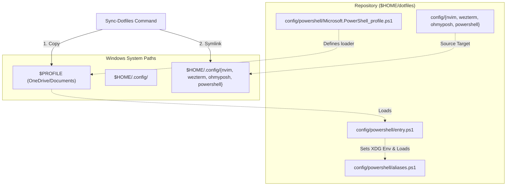

# ❄️ angelurano's dotfiles

A modern, clean, and highly optimized cross-platform developer environment configured for both **Linux (WSL2 + Debian 13 Trixie)** and **Windows (PowerShell 7 + Wezterm)**. 

This repository declaratively manages user packages, dotfiles, development environments, and terminal aesthetics using **Nix (Home Manager + Devenv)** and **PowerShell scripts**.

## System Architecture

This environment is designed to bridge the gap between Windows and Linux, sharing configurations (like Neovim, Oh My Posh, and Wezterm) seamlessly:

*   **Linux Environment**: WSL2 running **Debian 13 (Trixie)**, managed declaratively with **Nix (Multi-user installation)** and **Home Manager**.
*   **Windows Terminal**: **Wezterm** (configured in [config/wezterm/wezterm.lua](config/wezterm/wezterm.lua)) utilizing *Inconsolata Nerd Font Mono* and dark gradients.
*   **Aesthetics & Prompts**: **Oh My Posh** (configured in [config/ohmyposh/conf.toml](config/ohmyposh/conf.toml)) styled identically on both Windows and Linux.

## Linux Environment Setup & Updates

To simplify Linux profile management, link the `dotfiles` repository directly to the default Home Manager configuration path:

1.  **Backup legacy configuration** (if any exists):
    ```bash
    mv ~/.config/home-manager ~/.config/home-manager-backup
    ```
2.  **Synchronize via symbolic link (`ln -s`)**:
    Create a symbolic link pointing from the default Home Manager path to the `dotfiles` repository:
    ```bash
    ln -s ~/dotfiles ~/.config/home-manager
    ```

### Running Home Manager Switch

Because the repository is symlinked to `~/.config/home-manager`, Home Manager automatically locates the flake configuration under the active username. Specifying `--flake` paths is no longer necessary, and configuration changes can be built and applied from any system directory by running:

```bash
home-manager switch
```

To dry-run and verify the Nix configuration for compilation or evaluation errors before applying changes, a **dry-run build** can be executed:
```bash
home-manager build
```
This creates a temporary `./result` symlink containing the compiled environment for verification, without altering the active system.

### Nix Flake Update & Dependency Upgrades

Nix Flakes locks dependencies (such as Nixpkgs packages and Home Manager modules) in `flake.lock`. To update these dependencies to their latest versions:

1.  **Update the lockfile** (re-fetching the latest revisions of all inputs):
    ```bash
    nix flake update
    ```
2.  **Rebuild and apply the update**:
    ```bash
    home-manager switch
    ```

> [!NOTE]
> A specific input can be updated (e.g., only `nixpkgs`) by running `nix flake update nixpkgs`.

## Core Shell Utilities

Traditional CLI tools are replaced with modern, fast, and feature-rich alternatives:

| Command | Alternative | Description |
| :--- | :--- | :--- |
| `cat` | **`bat`** | Cat clone with syntax highlighting and Git integration. |
| `man` | **`batman`** | Manpage viewer styled using `bat` layout and colors. |
| `ls` | **`eza`** | Modern replacement for `ls` with file icons, colors, and git status. |
| `cd` | **`zoxide`** | Smart directory jump tool (`z`) that learns directory navigation habits. |
| `find` | **`fd`** | Simple, fast, and user-friendly alternative to `find`. |
| - | **`fzf` / `PSFzf`** | Command-line fuzzy finder for files, history, and completions. |
| `ranger` | **`yazi`** | Modern, blazing-fast terminal file manager with image previews. |
| `top` | **`btop`** | Beautiful and interactive terminal resource monitor. |
| `curl` | **`xh`** | Friendly and fast tool for sending HTTP requests. |
| `neofetch`| **`fastfetch`** | Ultra-fast system information reporting utility. |
| `nix shell`| **`,` (comma)** | Run any command from nixpkgs on the fly without installing it globally (via `nix-index`). |

## Nix Flake Templates (Devenv)

To keep project-level development environments clean and portable, this repository exports lightweight **Devenv templates** (without cluttering directories with intermediate `flake.nix` files). 

### Available Templates
*   `bun`: Bun runtime, lockfiles, and environment checks.
*   `c`: C development environment (configured with `gcc`).
*   `cpp`: C++ development environment (configured with `g++`).
*   `node`: Node.js development (pinned to Node 22).
*   `python`: Python interpreter and virtual environment managers.

### Bootstrapping a New Project
To initialize an environment, run the following inside the project directory:
```bash
nix flake init -t path:/home/angeldeb/dotfiles#<template>
```

This will copy three files into the folder:
1.  `devenv.nix`: Declares packages and language configs.
2.  `devenv.yaml`: Resolves dependencies.
3.  `.envrc`: Configured with `eval "$(devenv direnvrc)"` and `use devenv` for zero-overhead auto-loading.

### Working with Project Shells (Devenv & Direnv)

Once a template is initialized in a project folder, the development environment (which loads Node, Bun, Python compilers, etc.) can be activated in two ways:

1.  **Automatic Activation with Direnv (Recommended)**:
    This environment is pre-configured with `direnv` integration. The first time the terminal enters a project directory containing an `.envrc` file, `direnv` blocks execution for security until authorized. To authorize execution, run:
    ```bash
    direnv allow
    ```

    *   **Automatic activation**: Upon entering the directory (`cd`), `direnv` reads the `.envrc` file, compiles the `devenv` dependencies and variables, and injects them automatically into the active shell.
    *   **Automatic deactivation**: Upon leaving the directory (`cd ..`), the tools and variables are unloaded from the `$PATH`, keeping the terminal environment clean.
    *   **Change detection**: If `devenv.nix` or `devenv.yaml` is modified, `direnv` temporarily blocks the environment and prompts to run `direnv allow` again to reload the changes.

2.  **Manual Activation (Nested Subshell)**:
    If `direnv` is not used, or if an isolated development session is required manually, a nested subshell containing all development tools can be launched with:
    ```bash
    devenv shell
    ```
    *   This downloads all declared dependencies and starts an interactive nested subshell.
    *   To exit this secondary session and return to the main terminal, run:
        ```bash
        exit
        ```

3.  **Manual Pre-commit Hook Verification**:
    To test or run formatting and code-quality hooks (such as `nixfmt` for Nix format checks) on files manually before committing:
    ```bash
    devenv tasks run devenv:git-hooks:run
    ```

### Creating New Environments

For bootstrapping new environments or generating custom configurations:

*   **From Scratch**: Run `devenv init` inside a clean project directory to scaffold a default configuration (`devenv.nix`, `devenv.yaml`, etc.).
*   **Via Web Interface**: Visit [devenv.new](https://devenv.new/) to interactively generate configuration files tailored to a specific tech stack.

## Windows & PowerShell Sync System

For the Windows side, dotfiles are stored under `$HOME\dotfiles` and synchronized to the standard `$HOME\.config` directory using a custom symlink loader.

### Synchronization Flow



### Initial Setup Steps on Windows
1.  Clone this repository to the Windows home folder as `dotfiles` (so it resides at `C:\Users\<username>\dotfiles`).
2.  Open **PowerShell 7+** (Wezterm will load this by default).
3.  Navigate to the dotfiles directory:
    ```powershell
    cd ~/dotfiles
    ```
4.  Manually dot-source the aliases file containing the sync utility:
    ```powershell
    . .\config\powershell\aliases.ps1
    ```
5.  Execute the sync command:
    ```powershell
    Sync-Dotfiles
    ```

### How the Sync Works:
*   It deletes any old configs and creates symbolic links in `$HOME\.config\` pointing back to the repository's `nvim`, `wezterm`, `ohmyposh`, and `powershell` configuration directories.
*   It copies [Microsoft.PowerShell_profile.ps1](config/powershell/Microsoft.PowerShell_profile.ps1) directly to the active Windows `$PROFILE` path.
*   When a new PowerShell shell launches, it reads `$PROFILE`, sets up standard XDG paths (`$env:XDG_CONFIG_HOME = "$HOME\.config"`, etc.), and boots [entry.ps1](config/powershell/entry.ps1) to load Oh My Posh, icons, zoxide, and aliases.

## XDG Base Directory Compliance

This repository enforces **XDG compliance** globally in [home/shell.nix](home/shell.nix) to redirect caches, configuration files, and histories (e.g., for Python, NPM, Cargo, Go) out of the root of the home directory, keeping it clean and clutter-free.

_See [XDG Base Directory - ArchWiki](https://wiki.archlinux.org/title/XDG_Base_Directory)._

## Maintenance & Disk Cleanup

Nix and Devenv accumulate old versions, configurations, and build caches over time. Run these commands periodically to reclaim disk space:

### Nix & Home Manager Cleanup

*   **List Home Manager Generations**:
    ```bash
    home-manager generations
    ```
*   **Clean Home Manager Generations** (deletes configurations older than 14 days):
    ```bash
    home-manager expire-generations "-14 days"
    ```
*   **Complete Nix Garbage Collection** (removes all old generations of user profiles and deletes unused packages from the Nix store):
    ```bash
    nix-collect-garbage -d
    ```
    In multi-user Nix installations, system-wide or root-level packages can also be cleaned by running:
    ```bash
    sudo nix-collect-garbage -d
    ```

*   **Nix Store Optimisation** (finds duplicate files across the Nix store and hard-links them, which can reclaim significant disk space):
    ```bash
    nix store optimise
    ```

### Devenv Cleanup
*   **Garbage collect old Devenv shell environments and build profiles**:
    ```bash
    devenv gc
    ```

