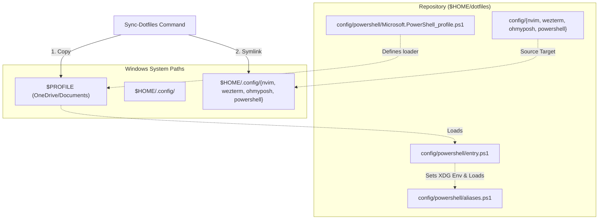

# 🌌 angelurano's Dotfiles

A modern, clean, and highly optimized cross-platform developer environment configured for both **Linux (WSL2 + Debian 13 Trixie)** and **Windows (PowerShell 7 + Wezterm)**. 

This repository declaratively manages user packages, dotfiles, development environments, and terminal aesthetics using **Nix (Home Manager + Devenv)** and **PowerShell scripts**.

---

## 💻 System Architecture

This environment is designed to bridge the gap between Windows and Linux, sharing configurations (like Neovim, Oh My Posh, and Wezterm) seamlessly:

*   **Linux Environment**: WSL2 running **Debian 13 (Trixie)**, managed declaratively with **Nix (Multi-user installation)** and **Home Manager**.
*   **Windows Terminal**: **Wezterm** (configured in [config/wezterm/wezterm.lua](config/wezterm/wezterm.lua)) utilizing *Inconsolata Nerd Font Mono* and dark gradients.
*   **Aesthetics & Prompts**: **Oh My Posh** (configured in [config/ohmyposh/conf.toml](config/ohmyposh/conf.toml)) styled identically on both Windows and Linux.

---

## 🛠️ Core Shell Utilities

Traditional CLI tools are replaced with modern, fast, and feature-rich alternatives:

| Command | Alternative | Description |
| :--- | :--- | :--- |
| `cat` | **`bat`** | Cat clone with syntax highlighting and Git integration. |
| `man` | **`batman`** | Manpage viewer styled using `bat` layout and colors. |
| `ls` | **`eza`** | Modern replacement for `ls` with file icons, colors, and git status. |
| `cd` | **`zoxide`** | Smart directory jump tool (`z`) that learns your navigation habits. |
| `find` | **`fd`** | Simple, fast, and user-friendly alternative to `find`. |
| - | **`fzf` / `PSFzf`** | Command-line fuzzy finder for files, history, and completions. |

---

## ❄️ Nix Flake Templates (Devenv)

To keep project-level development environments clean and portable, this repository exports lightweight **Devenv templates** (without cluttering directories with intermediate `flake.nix` files). 

### Available Templates
*   `bun`: Bun runtime, lockfiles, and environment checks.
*   `c`: C/C++ compiler toolchain (`gcc`, `gnumake`, `cmake`).
*   `node`: Node.js development (pinned to Node 22).
*   `python`: Python interpreter and virtual environment managers.

### Bootstrapping a New Project
To spin up an environment, run the following inside your new project directory:
```bash
nix flake init -t path:/home/angeldeb/dotfiles#<template>
```

This will copy three files into the folder:
1.  `devenv.nix`: Declares packages and language configs.
2.  `devenv.yaml`: Resolves dependencies.
3.  `.envrc`: Configured with `eval "$(devenv direnvrc)"` and `use devenv` for zero-overhead auto-loading.

Entering the directory will automatically prompt `direnv` to activate your Devenv shell.

---

## 🌀 Windows & PowerShell Sync System

For the Windows side, dotfiles are stored under `$HOME\dotfiles` and synchronized to the standard `$HOME\.config` directory using a custom symlink loader.

### Synchronization Flow



### Initial Setup Steps on Windows
1.  Clone this repository to your user's home folder on Windows as `dotfiles` (so it resides at `C:\Users\<username>\dotfiles`).
2.  Open **PowerShell 7+** (Wezterm will load this by default).
3.  Navigate to your dotfiles directory:
    ```powershell
    cd ~/dotfiles
    ```
4.  Manually dot-source the aliases file containing the sync utility:
    ```powershell
    . .\config\powershell\aliases.ps1
    ```
5.  Execute the sync command:
    ```powershell
    Sync-Dotfiles
    ```

### How the Sync Works:
*   It deletes any old configs and creates symbolic links in `$HOME\.config\` pointing back to the repository's `nvim`, `wezterm`, `ohmyposh`, and `powershell` configuration directories.
*   It copies [Microsoft.PowerShell_profile.ps1](config/powershell/Microsoft.PowerShell_profile.ps1) directly to your active Windows `$PROFILE` path.
*   When a new PowerShell shell launches, it reads `$PROFILE`, sets up standard XDG paths (`$env:XDG_CONFIG_HOME = "$HOME\.config"`, etc.), and boots [entry.ps1](config/powershell/entry.ps1) to load Oh My Posh, icons, zoxide, and aliases.

---

## 🧹 XDG Base Directory Compliance

This repository enforces **XDG compliance** globally in [home/shell.nix](home/shell.nix) to prevent tool clutter in your Linux home directory:

*   **NPM**: Configuration moved to `~/.config/npm/npmrc` and cache to `~/.cache/npm/`.
*   **Node.js**: Interactive REPL history redirected to `~/.local/state/node/node_repl_history`.
*   **Python**:
    *   Cache moved to `~/.cache/python/`.
    *   User base packages moved to `~/.local/share/python/`.
    *   Interactive shell history redirected to `~/.local/state/python/history` (native on Python 3.13+, and compatible via `pythonstartup` on older versions).
*   **Readline**: `.inputrc` configurations redirected to `~/.config/readline/inputrc`.
